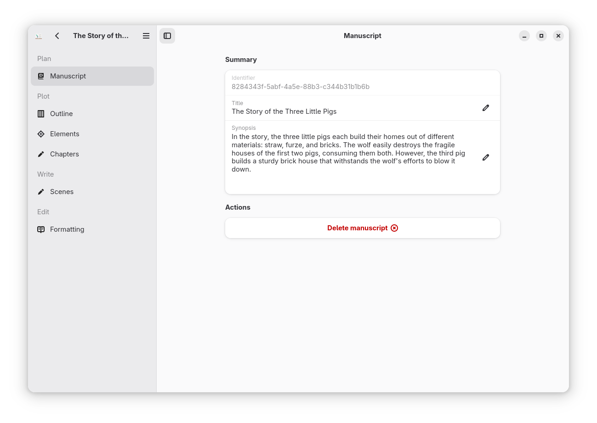

# Scriptorium


<p>Write short stories, novels, or anything in between in an IDE for books.</p>

Main features:

  * Manage a set of scenes
  * Edit the text of the scene in a focused writer tool
  * Switch to dark mode or light mode if desired 
  * Manage a set of chapters
  * Assign scenes to chapter
  * Manage a set of story elements (Places, characters, props, ...)
  * Assign story elements to scenes
  * Use the overview panel to re-organise the structure of the book
  * Use the preview panel to see and adjust the look of the final book
  * Versioning managed via Git on the back-end using YAML and HTML files

## Screenshots



More screenshots are available in `data/screenshots`


## Build and run

To build and run the app once you cloned the repo do:

```
flatpak run org.flatpak.Builder --force-clean --sandbox --user --install \
    --install-deps-from=flathub --ccache \
    --mirror-screenshots-url=https://dl.flathub.org/media/ \
    --repo=repo builddir io.github.cgueret.Scriptorium.json
```

and then

```
flatpak run io.github.cgueret.Scriptorium
```

You may have to run this first if it's the first time you build:

```
flatpak install -y flathub org.flatpak.Builder
flatpak remote-add --if-not-exists --user flathub \
    https://dl.flathub.org/repo/flathub.flatpakrepo
```

## Credit

The quill on the icon comes from <a href="https://www.svgrepo.com/svg/229764/quill">SVG Repo</a>

This project contains a lot of codes inspired by many other open source projects, thanks everyone!

